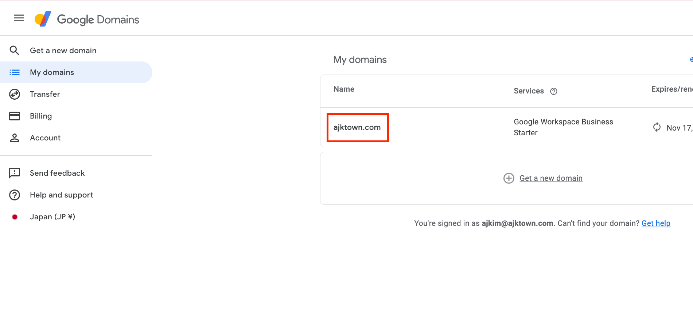
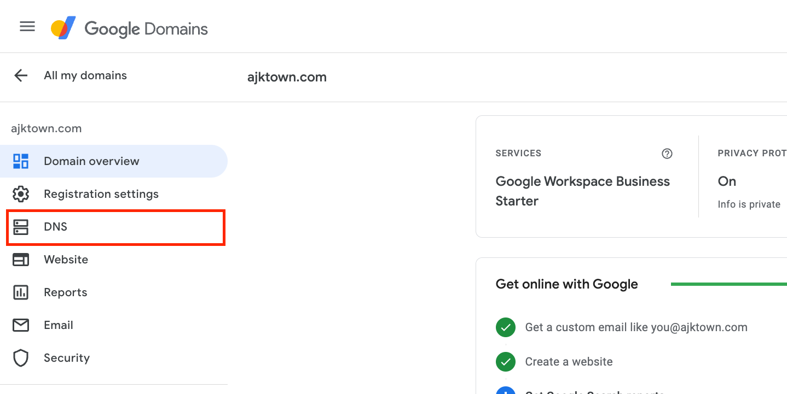
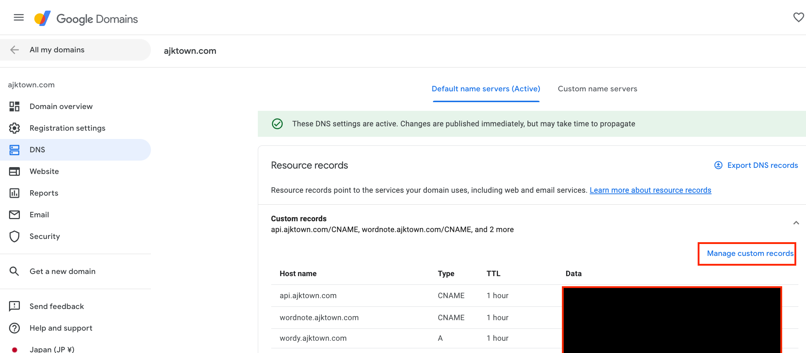
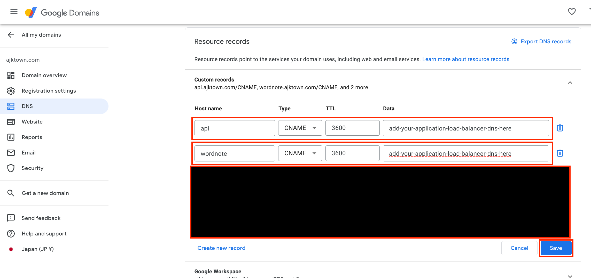
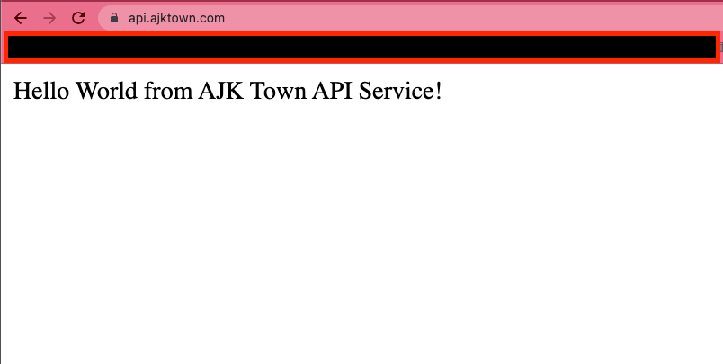

# DNS Setup

<!-- TOC -->

- [DNS Setup](#dns-setup)
  - [Overview](#overview)
  - [How to set up (Google Domain)](#how-to-set-up-google-domain)
  - [Check if DNS is successfully pointed](#check-if-dns-is-successfully-pointed)

<!-- /TOC -->

## Overview

We are going to set up DNS that should point to AWS ALB for final exposure to the world.

User => DNS => ALB => Ingress => Service => Pod

## How to set up (Google Domain)

go to `https://domains.google.com`

Click your domain

Click DNS

Click Manage Custom Records

Add your AWS Load Balancer (ALB) DNS and save

## Check if DNS is successfully pointed

