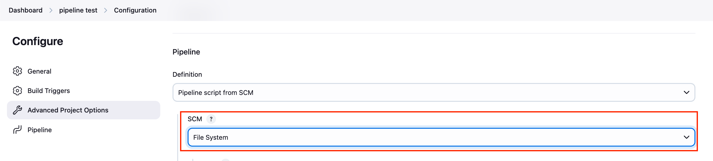

# Install Jenkins on Local Mac OS

<!-- TOC -->

- [Install Jenkins on Local Mac OS](#install-jenkins-on-local-mac-os)
  - [Overview](#overview)
    - [Sub-goal](#sub-goal)
  - [Steps](#steps)
    - [Install Jenkins for Mac OS](#install-jenkins-for-mac-os)
    - [Obtain Access Token For](#obtain-access-token-for)
    - [Install Necessary Plugins](#install-necessary-plugins)
      - [File System SCM](#file-system-scm)
    - [Install Optional Plugins](#install-optional-plugins)
      - [OpenID Connect Provider (OIDC Provider)](#openid-connect-provider-oidc-provider)

<!-- /TOC -->

## Overview
The goal of this document is to share the steps to install Jenkins on a local Mac OS machine.

### Sub-goal
The indirect/sub-goal of installing Jenkins is to build/deploy locally and push to the remote server.

## Steps

### Install Jenkins for Mac OS
https://www.jenkins.io/doc/book/installing/macos/

### Obtain Access Token For

### Install Necessary Plugins
Install the following plugins to Jenkins.

#### File System SCM
You can run Jenkins jobs from Jenkinsfile on your local device, instead of GitHub.

### Install Optional Plugins
#### OpenID Connect Provider (OIDC Provider)
https://plugins.jenkins.io/oidc-provider/
