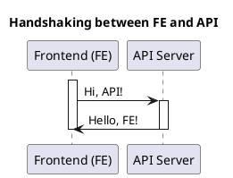

# Install plantuml


<!-- TOC -->

- [Install plantuml](#install-plantuml)
  - [Overview](#overview)
  - [Prerequisites](#prerequisites)
    - [Sample Plantuml Code](#sample-plantuml-code)
    - [Two ways to render plantuml code](#two-ways-to-render-plantuml-code)
      - [Run locally](#run-locally)
      - [Run remotely](#run-remotely)

<!-- /TOC -->

## Overview
How to install plantuml and test


## Prerequisites
- What is Plantuml?
  - `Plantuml` is a component that allows you to quickly write: Sequence diagram · Usecase diagram · Class diagram · Object diagram · Activity diagram (Detailed information [here](https://plantuml.com/))


### Sample Plantuml Code
You can do `command + shift + v` to see the preview of the flow below:

### Two ways to render plantuml code
1. Run it locally with local docker image
1. Run it remotely with the provided plantuml server

#### Run locally

Pros
- You can secure your plantuml code by not sending it to 3rd party remote server

Cons
- Requires docker to be run 9
```
docker run -d -p 12000:8080 plantuml/plantuml-server:jetty
```

- Requires local setting below


#### Run remotely

Pros
- Does not require remote server

Cons
- Requires internet connection
- Your data will be sent to plantuml
- Generally slower