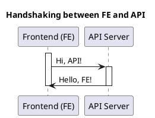

# Install plantuml


<!-- TOC -->

- [Install plantuml](#install-plantuml)
  - [Overview](#overview)
  - [Prerequisites](#prerequisites)
    - [Sample Plantuml Code](#sample-plantuml-code)
  - [Basic installs](#basic-installs)
    - [Install PlantUML extension if not installed](#install-plantuml-extension-if-not-installed)
  - [Decide whether to run locally or remotely](#decide-whether-to-run-locally-or-remotely)
  - [Run Locally](#run-locally)
    - [Run plantuml docker image locally](#run-plantuml-docker-image-locally)
    - [Set local setting](#set-local-setting)
    - [Enable loading content over http served from localhost](#enable-loading-content-over-http-served-from-localhost)
    - [Done](#done)
    - [Done](#done-1)

<!-- /TOC -->

## Overview
How to install plantuml and test


## Prerequisites
- What is Plantuml?
  - `Plantuml` is a component that allows you to quickly write: Sequence diagram · Usecase diagram · Class diagram · Object diagram · Activity diagram (Detailed information [here](https://plantuml.com/))
  - You can run it locally, or remotely


### Sample Plantuml Code
You can do `command + shift + v` to see the preview of the flow below:


## Basic installs
Basic installs contain the shared install for both local and remote

### Install PlantUML extension if not installed
Install [here](/install/vs_code_extensions/install-ajktown-recommended-extensions.md#plantuml)


## Decide whether to run locally or remotely

- If you would like to run plantuml locally, you can follow the steps below.
  - Else, check out this [doc](./use-remote-plantuml-server.md)


## Run Locally

|                     Pros                     |             Cons              |
|:--------------------------------------------:|:-----------------------------:|
| Your data is not sent to the plantuml server | Requires docker to be running |

### Run plantuml docker image locally
```
docker run -d -p 12000:8080 plantuml/plantuml-server:jetty
```

### Set local setting
**open setting**
```
command + shift + p
```


**set local plantuml setting**


### Enable loading content over http served from localhost


### Done
You can test it as explained in [Sample Plantuml Code](#sample-plantuml-code)