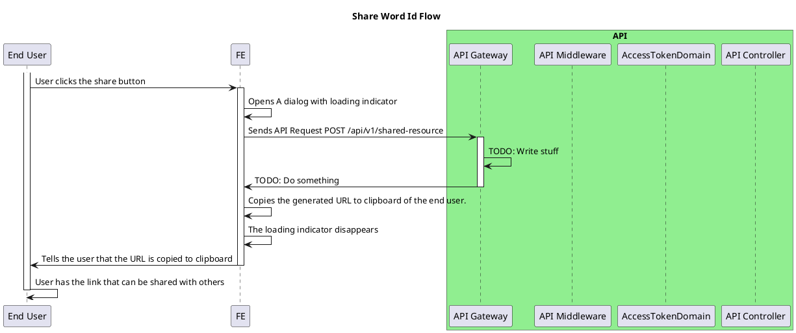

# Share Feature

<!-- TOC -->

- [Share Feature](#share-feature)
  - [Overview](#overview)
  - [General Flow](#general-flow)

<!-- /TOC -->

## Overview

Share feature is basically share your word card with others by generating SharedResourceDomain.

## General Flow

