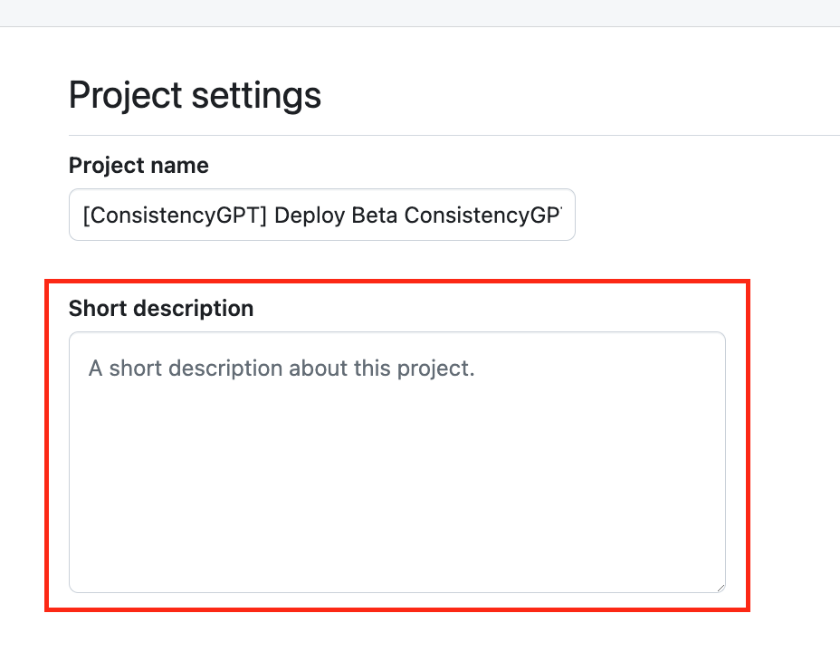
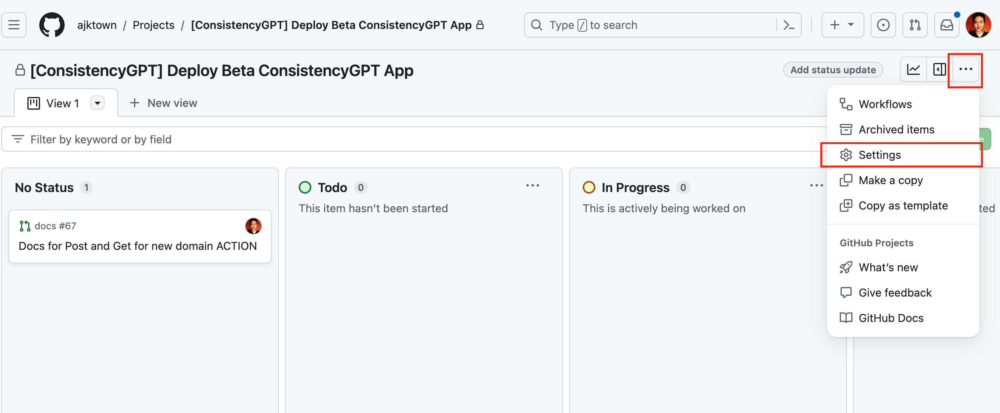

# How to create GitHub Project

<!-- TOC -->

- [How to create GitHub Project](#how-to-create-github-project)
  - [Overview](#overview)
  - [Steps](#steps)
    - [Go to GitHub Page & Click New Project](#go-to-github-page--click-new-project)
    - [Select Board](#select-board)
    - [Create Project with appropriate name](#create-project-with-appropriate-name)
      - [Naming rule](#naming-rule)
      - [AppName](#appname)
    - [Write a short description of this project](#write-a-short-description-of-this-project)
    - [Make it public](#make-it-public)
    - [Done](#done)

<!-- /TOC -->

## Overview
This document explains how to create a GitHub project.

## Steps

### Go to GitHub Page & Click New Project
https://github.com/orgs/ajktown/projects

### Select Board
AJK Town only uses `Board` at this moment (Feb 2, 2024)

### Create Project with appropriate name

#### Naming rule
The following is the rule
- `[<AppName>] <YourProjectName>`
  - i.e)
    - [ConsistencyGPT] Deploy Beta ConsistencyGPT App
    - [WordnoteGPT] Share Word Card Feature

#### AppName
- GitHub
  - Any GitHub settings or usage related project
- WordnoteGPT
- ConsistencyGPT

*api or documentation is not included in the project name*
*Only apps that is directly related to the user is considered as AppName*

### Write a short description of this project

### Make it public
Once created, make it public (if it is okay)

*Go setting*

*Scroll down to the bottom and make it public*

### Done
Associate your related PRs with the project you just created.

